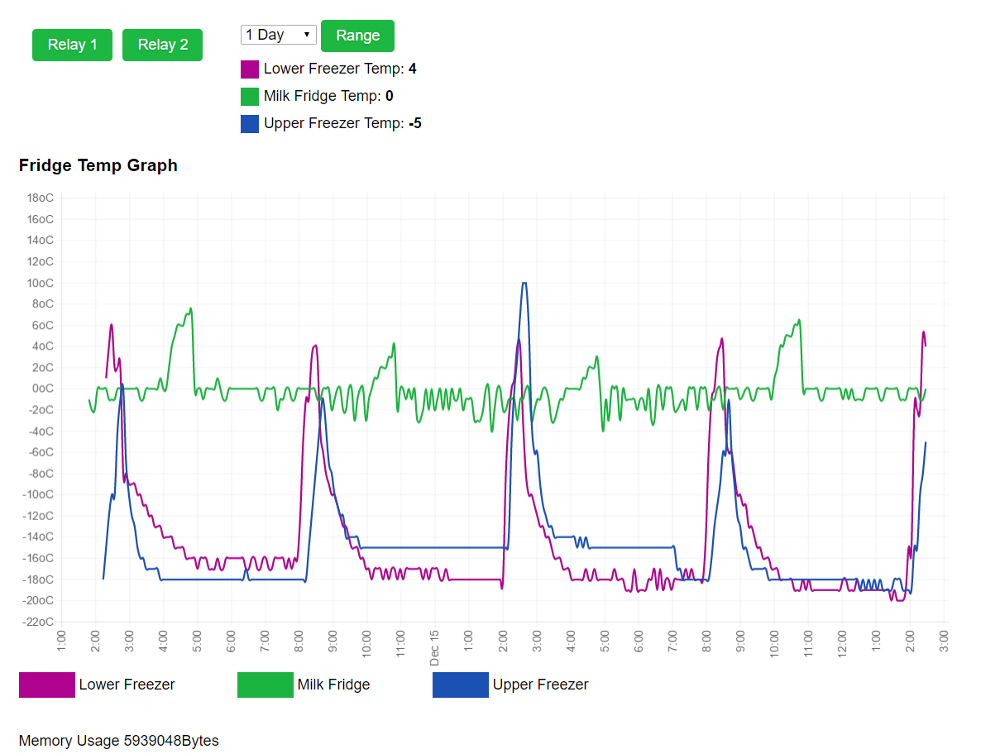

# Smart - Supermarket

###Devices to make running a shop easier!

Mainly coded in Python, PHP and JavaScript.

###Current functionality:
- Measures fridge & freezer temps every 5 minutes.
- Plots them on a mobile friendly graph, with adjustable range
- If the temperature goes above the limit for more than 100 minutes an IFTT recipe is called and alerts the user on their phone & smart watch.
- Security Shutters automated in Openhab2 to allow control over Wi-Fi on smart phones.
- Shutters can be controlled separately or as a whole to allow faster opening the supermarket in the morning.

###Future functionality:
- Intergrate fridge temps into Openhab.
- Look at automating some lights and switches

## Requirements:
- Raspberry Pi - Raspbian with OneWire enabled
- DS18b20 OneWire temperature Sensors
- Apache, PHP, Mysql, Mysqli and Python
- IFTT account with Maker recipe.

## To USE (Temperature Sensors):
Copy Web Server files to WWW directory.

Copy python files to the Pi.

Make a mysql database called TempSensors and then run makeDB.py

Connect the sensors to the pi

| DS18b20 | Signal | Raspberry Pi          |
| ------- |--------| ----------------------|
| GND     | Ground | GND                   |
| DQ      | Data   | GPIO 4 (*Pulled high) |
| VDQ     | +3.3v  | +3.3v                 |

(4.7k ohm resistor between DQ and +3.3v)

Change the sensor serial numbers in readTemps.py to your own. (found by opening the OneWire devices folder)

Add in the key for IFTT maker.

run readTemps.py and ensure it collects the temperatures correctly.

Open the website and enjoy the data.

## To USE (Automated Shutters):
Download and install openhab2 on raspberry pi.
Install Binding GPIO to allow openhab to control Raspberry PI GPIO

Components used:

Relay: OMRON G5Q-1A4EU 5DC RELAY, SPST, 250VAC, 10A

Transistor: 2N3904 with 4k Rb

Raspberry pi available GPIO: 4, 17, 27, 22, 18, 23, 24, 25 (Other GPIO can have pull ups/ downs which will make the circuit unstable on pi boot).

To connect the raspberry pi to shutters follow the circuit below.

##NOTE

Once Openhab2 is running the shutters have been tested make sure to enable security.

Security I would recommend but not limited to:

Reverse proxy with Authentication enabled.

SSL connection

IPtables to close unnecessary ports

VLAN with VPN access
